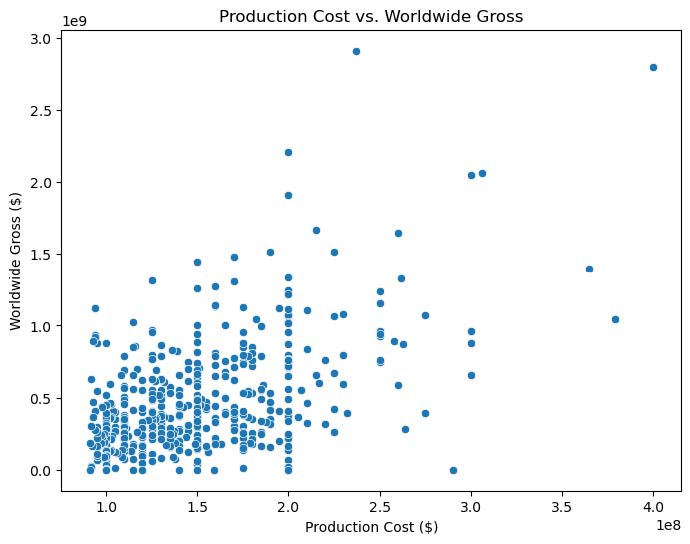
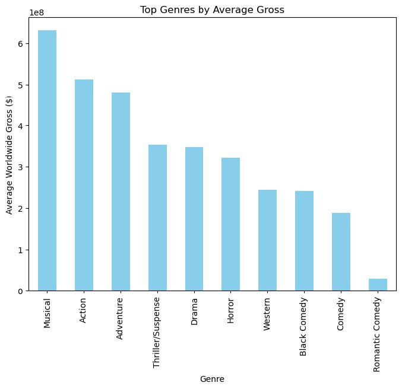
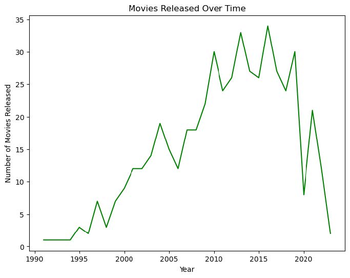
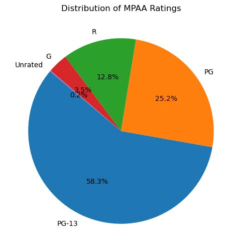
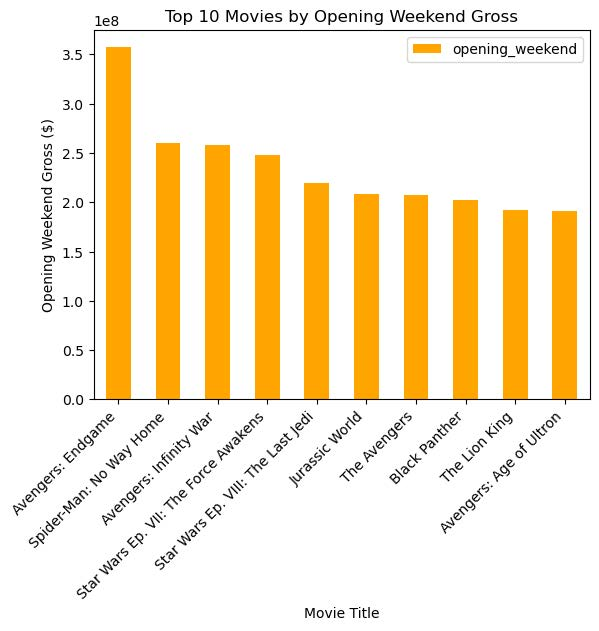
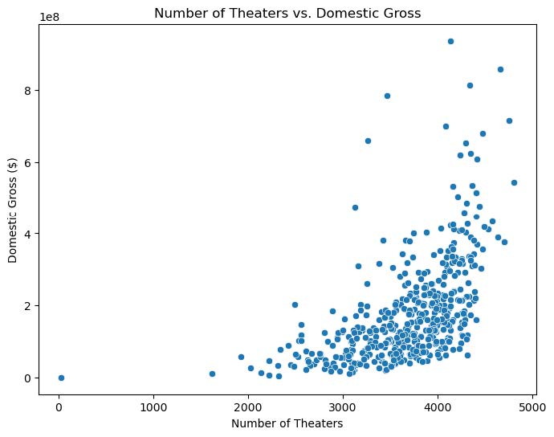
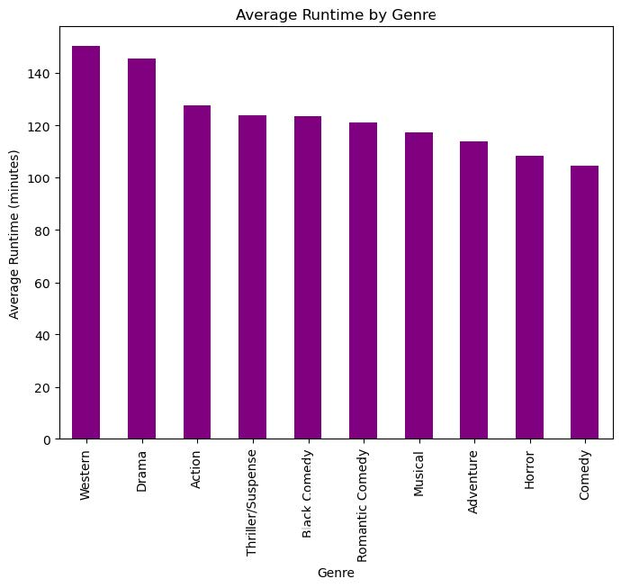
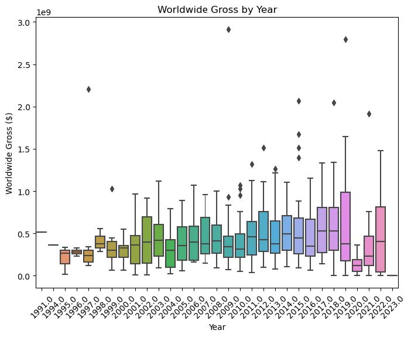
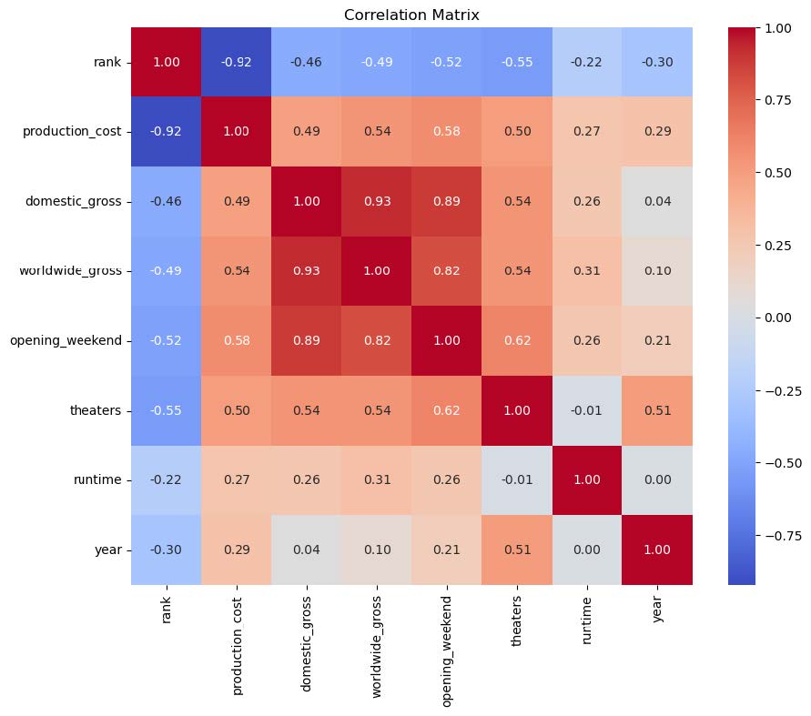
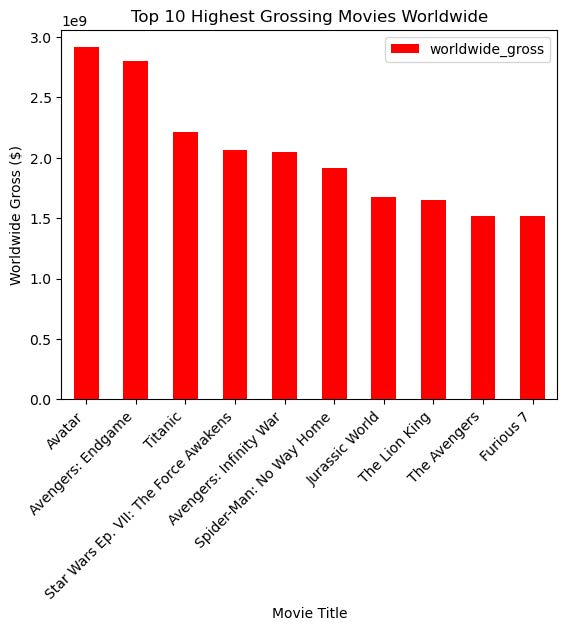

# project-03
Project 3

Data Visualization Project

Deployed Site:  https://skutlick.github.io/project-03-site/

Overview

Data Resource:  https://www.kaggle.com/datasets/mitchellharrison/top-500-movies-budget

The Data Visualization Project provides an in-depth analysis of a dataset containing information on various movie metrics, such as production costs, revenue, ratings, and genres. The purpose of this project is to deliver interactive and insightful visualizations that allow users to explore and interpret industry trends and financial aspects of top 500 movies. By leveraging modern data visualization tools and techniques, this project aims to present data in a clear and engaging manner, facilitating informed decision-making and deeper understanding of the movie industry.

JavaScript Implementation
1. Dynamic Image Toggling

JavaScript is used to switch between different images based on user selection from a dropdown menu. This functionality is implemented using the change event listener on the dropdown element. The JavaScript code hides all images initially and only displays the image corresponding to the selected dropdown value.

2. Interactive Data Visualizations

The project uses Plotly.js, a powerful JavaScript library, to create interactive visualizations. Plotly charts are embedded in the HTML file and configured to update based on user inputs or interactions.
3. User-Driven Interaction

The website includes interactive elements such as dropdown menus to select different types of plots. This allows users to view various data visualizations without needing to reload the page.

Website Structure
1. HTML

The HTML file (index.html) sets up the structure of the webpage, including headers, dropdown menus, and placeholders for visualizations.
2. CSS

The CSS file (styles.css) styles the webpage elements and ensures that images are hidden or shown as needed. It also includes basic styling for layout and appearance.
3. JavaScript Files

script.js: Handles image toggling based on dropdown selection.
visualizations.js: Manages Plotly chart creation and updates.
Summary
The website leverages JavaScript for dynamic image display and interactive data visualizations. By combining HTML, CSS, and JavaScript, the project creates a user-friendly interface for exploring movie data through various visualizations. The use of external libraries like Plotly enhances the interactivity and presentation of data.

Graph Explanation: 

1. Production Cost vs. Worldwide Gross
Explanation: This scatter plot illustrates the relationship between the production cost of a movie and its worldwide gross revenue. Each point on the graph represents a movie, with the x-axis showing the production cost and the y-axis showing the worldwide gross. The plot helps to visualize whether higher production costs correlate with higher earnings.
Insights:
Direct Correlation: If there's a positive trend, it suggests that movies with higher production budgets tend to earn more globally.
Outliers: You may identify movies that were exceptionally profitable or underperformed relative to their budgets.
Risk Assessment: This graph is valuable for studios to assess the financial risk of investing in high-budget films.

    

2. Top Genres by Average Gross
Explanation: This bar chart ranks movie genres based on their average worldwide gross. Each bar represents a genre, and the height of the bar reflects the average gross revenue for movies within that genre.
Insights:
Genre Popularity: Helps identify which genres are most lucrative in the global market.
Investment Strategy: Studios can use this information to decide which genres might be safer investments or worth exploring further.
Market Trends: It provides insight into changing audience preferences over time.

    

3. Movies Released Over Time
Explanation: This line chart shows the number of movies released each year. The x-axis represents the year, and the y-axis represents the number of movies released in that year.
Insights:
Industry Growth: A rising trend indicates growth in the film industry, with more movies being produced over time.
Economic Influence: You can correlate dips or spikes with historical events, economic conditions, or technological advancements (e.g., the impact of streaming services).
Cultural Shifts: Changes in the number of releases might reflect cultural or regulatory shifts in different eras.

    

4. Distribution of MPAA Ratings
Explanation: This pie chart visualizes the distribution of MPAA ratings (e.g., G, PG, PG-13, R) among the top 500 movies. Each segment of the pie represents the proportion of movies that fall under each rating category.
Insights:
Audience Demographics: Helps understand which ratings are most common among successful films, indicating target audience demographics.
Content Trends: If certain ratings dominate, it may reflect trends in the type of content being produced.
Regulatory Impact: Shows how rating decisions might influence a movie’s success, especially concerning market accessibility.

    

5. Top 10 Movies by Opening Weekend Gross
Explanation: This bar chart lists the top 10 movies based on their opening weekend gross revenue. Each bar represents a movie, and the height indicates the gross earnings during its opening weekend.
Insights:
Marketing Success: A strong opening weekend typically indicates successful marketing and high anticipation.
Franchise Strength: You may notice that certain franchises consistently perform well on opening weekends.
Box Office Predictions: Studios can use this data to estimate future earnings based on opening performance.

    

6. Number of Theaters vs. Domestic Gross
Explanation: This scatter plot examines the relationship between the number of theaters a movie was released in and its domestic gross revenue. The x-axis represents the number of theaters, and the y-axis represents domestic gross.
Insights:
Distribution Strategy: A positive correlation suggests that wider releases tend to generate more revenue.
Theater Saturation: Identifies the point where increasing the number of theaters no longer significantly boosts revenue.
Market Reach: Helps studios understand the importance of broad distribution in maximizing earnings.

    

7. Average Runtime by Genre
Explanation: This bar chart displays the average runtime of movies across different genres. Each bar represents a genre, and its height indicates the average length of movies within that genre.
Insights:
Genre Characteristics: Some genres might naturally have longer or shorter films (e.g., epics vs. comedies).
Viewer Preferences: Helps understand whether longer or shorter films tend to perform better within specific genres.
Editing Decisions: Studios can use this information to make informed decisions about movie length based on genre expectations.

    

8. Worldwide Gross by Year (Box Plot)
Explanation: This box plot visualizes the distribution of worldwide gross revenue by year. Each box represents the range of earnings for movies released in that year, with the line inside the box showing the median gross.
Insights:
Earnings Distribution: The box plot shows the variability in movie earnings year by year, highlighting whether most movies are clustered around a certain gross or if there’s a wide range.
Outliers: Identifies movies that significantly outperformed or underperformed relative to their peers.
Market Evolution: Tracks how the overall revenue potential of movies has changed over time.

    

9. Correlation Matrix
Explanation: This heatmap presents the correlation between different numerical variables in the dataset, such as production cost, domestic gross, worldwide gross, and runtime. The color intensity indicates the strength of the correlation.
Insights:
Identifying Relationships: Strong correlations can reveal which factors are most influential in a movie’s financial success.
Predictive Modeling: The correlation matrix is useful for building predictive models, helping to determine which variables to focus on.
Unexpected Insights: Sometimes, unexpected correlations can lead to new hypotheses or strategies.

    

10. Top 10 Highest Grossing Movies Worldwide
Explanation: This bar chart lists the top 10 highest-grossing movies worldwide. Each bar represents a movie, and the height indicates the total gross revenue.
Insights:
Box Office Records: Highlights the most commercially successful movies, often featuring blockbusters or franchise films.
Market Dominance: Shows the dominance of certain genres, studios, or franchises in the global market.
Cultural Impact: These movies are often not only financially successful but also culturally significant, influencing trends and viewer expectations.
These expanded explanations provide a deeper understanding of the insights each graph can offer, helping you interpret the data more effectively.

    

